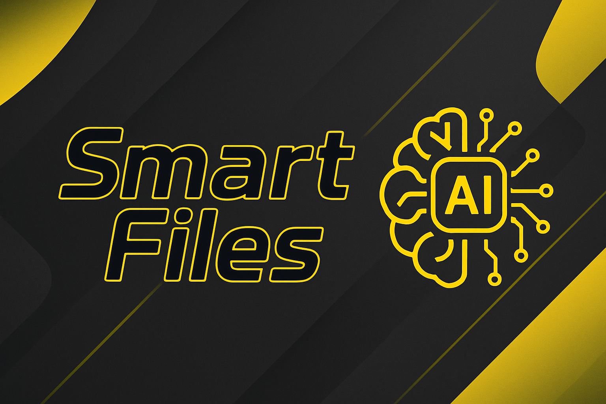

# Smart Files

<p align="center">
  
  <a href="README.md"></a>
  


> This project focuses on managing PDF and TXT files to simplify conversions, reading, processing, and summary with AI integration.

## ✨ Features

- 🤖 AI-powered PDF summarization.
- 📖 Convert PDF files to plain text with option of conversion single or multiple!
- 📚 Merge multiple PDF files into one.
- 📄 Extract raw text from PDF documents.

## ⚙️ Requirements

- Python3
- requests

## 🔐 API Token (Required)

To use the summarization feature, you need a Hugging Face API token.

1. Go to [hugging face](https://huggingface.co/settings/tokens).
2. Create a new token. (read access is enough)
3. Copy the token and paste it into your `config.json` file.

## 🚀 How to Run

1. Install requirements.
``` bash
    pip install -r requirements.txt
```
2. Clone this repository.
``` bash
    git clone https://github.com/guizcodes/smart-files
```
3. Run the main.py file!
``` bash
    python3 smart-files/src/main.py 
```

## ❓ How to use

You need to move your PDF files to the designated folder src/documents/pdf before using the application.

## 📝 License

Licensed under the [MIT License](LICENSE).