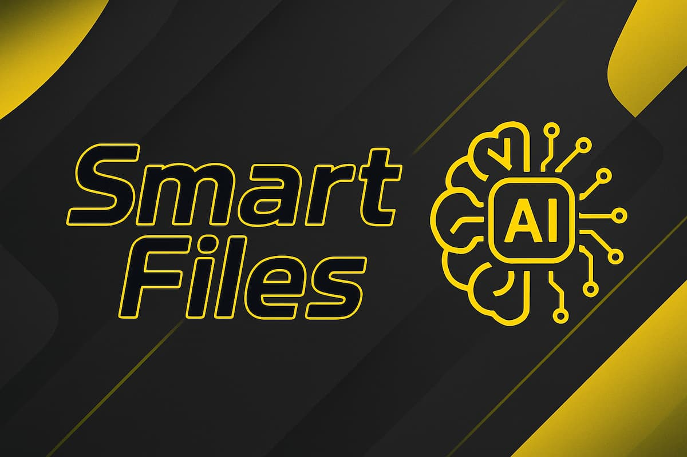

📄 🇺🇸 English version: [README.en-US.md](README.en-US.md)  

# Smart Files

<p align="center">
  
  
</p>



> Este projeto tem como foco o gerenciamento de arquivos PDF e TXT para simplificar conversões, leitura, processamento, e resumo com integração de IA.

## ✨ Funcionalidades

- 🤖 Resumo automático de arquivos PDF e TXT com IA.
- 📖 Conversão de arquivos PDF para TXT com opções de conversão única ou conversão de multiplos arquivos!
- 📚 Mesclagem de múltiplos arquivos PDF em um só.
- 📄 Extração de texto bruto de documentos PDF.

## ⚙️ Requisitos

- Python3  
- requests

## 🔐 Token de API (Obrigatório)

Para usar a função de resumo, você precisa de um token de API do Hugging Face.

1. Acesse [hugging face](https://huggingface.co/settings/tokens).  
2. Crie um novo token (permissão de leitura é suficiente).  
3. Copie o token e cole no seu arquivo `config.json`.

## 🚀 Como Executar

1. Instale os requisitos.
``` bash
    pip install -r requirements.txt
```
2. Clone o repositório.
``` bash
    git clone https://github.com/guizcodes/smart-files
```
3. Rode o arquivo main.py!
``` bash
    python3 smart-files/src/main.py 
```

## ❓ Como Usar

Você deve mover seus arquivos PDF para a pasta designada em src/documents/pdf antes de usar a aplicação.

## 📝 Licença

Licenciado sob a [Licença MIT](LICENSE).